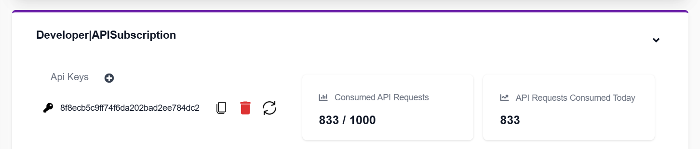
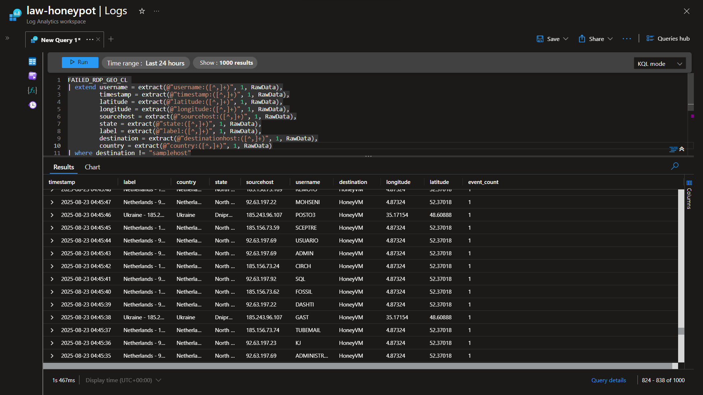
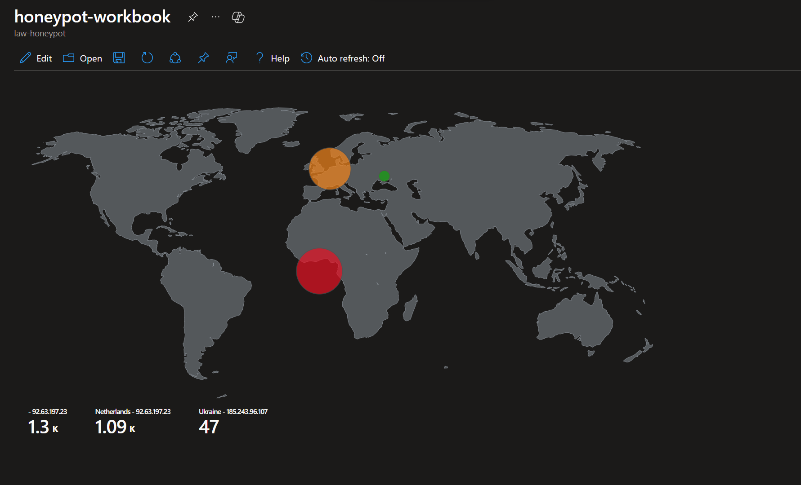

# Azure Honeypot Lab featuring Microsoft Sentinel as the SIEM


## Lab overview


---

## Azure resources

### Windows VM

- Name - HoneyVM
- Resource group (RG) - honeypot-lab
- Image - Windows 10 Pro, x64 Gen1
- Size - standard_B2s
- VNets - default

### NSG > Advanced > Configure NSG >

- NSG name - HoneyVM-nsg
- Source port ranges - * (allow all)
- Destination port ranges - * (allow all)
- Priority - 100

### Log Analytics workspace

- Name - law-honeypot
- RG - honeypot-lab

### MS Defender for Cloud > Management > Environment settings >

- Find Azure subscription 1 > law-honeypot

Settings > Defender plans >

- Turn on Servers  plan

Settings > Data collection >

- Turn on All events

### Log Analytics workspace > law-honeypot > Classic > Virtual Machines (deprecated) >

- Select HoneyVM, then CONNECT

### MS Sentinel

- Add law-honeypot to MS Sentinel

### Connect to HoneyVM via RDP

- Turn Windows firewall OFF

---

## GeoLocation API

- Get API key from IP Geolocation.io:  [https://ipgeolocation.io/ip-location-api.html](https://ipgeolocation.io/ip-location-api.html)




## Windows - PowerShell ISE script

```powershell
# Get API key from here: https://ipgeolocation.io/
$API_KEY      = "8f8ecb5c9ff74f6da202bad2ee784dc2"
$LOGFILE_NAME = "failed_rdp.log"
$LOGFILE_PATH = "C:\ProgramData\$($LOGFILE_NAME)"

# This filter will be used to filter failed RDP events from Windows Event Viewer
$XMLFilter = @'
<QueryList> 
   <Query Id="0" Path="Security">
         <Select Path="Security">
              *[System[(EventID='4625')]]
          </Select>
    </Query>
</QueryList> 
'@

<#
    This function creates a bunch of sample log files that will be used to train the
    Extract feature in Log Analytics workspace. If you don't have enough log files to
    "train" it, it will fail to extract certain fields for some reason -_-.
    We can avoid including these fake records on our map by filtering out all logs with
    a destination host of "samplehost"
#>
Function write-Sample-Log() {
    "latitude:47.91542,longitude:-120.60306,destinationhost:samplehost,username:fakeuser,sourcehost:24.16.97.222,state:Washington,country:United States,label:United States - 24.16.97.222,timestamp:2021-10-26 03:28:29" | Out-File $LOGFILE_PATH -Append -Encoding utf8
    "latitude:-22.90906,longitude:-47.06455,destinationhost:samplehost,username:lnwbaq,sourcehost:20.195.228.49,state:Sao Paulo,country:Brazil,label:Brazil - 20.195.228.49,timestamp:2021-10-26 05:46:20" | Out-File $LOGFILE_PATH -Append -Encoding utf8
    "latitude:52.37022,longitude:4.89517,destinationhost:samplehost,username:CSNYDER,sourcehost:89.248.165.74,state:North Holland,country:Netherlands,label:Netherlands - 89.248.165.74,timestamp:2021-10-26 06:12:56" | Out-File $LOGFILE_PATH -Append -Encoding utf8
    "latitude:40.71455,longitude:-74.00714,destinationhost:samplehost,username:ADMINISTRATOR,sourcehost:72.45.247.218,state:New York,country:United States,label:United States - 72.45.247.218,timestamp:2021-10-26 10:44:07" | Out-File $LOGFILE_PATH -Append -Encoding utf8
    "latitude:33.99762,longitude:-6.84737,destinationhost:samplehost,username:AZUREUSER,sourcehost:102.50.242.216,state:Rabat-Salé-Kénitra,country:Morocco,label:Morocco - 102.50.242.216,timestamp:2021-10-26 11:03:13" | Out-File $LOGFILE_PATH -Append -Encoding utf8
    "latitude:-5.32558,longitude:100.28595,destinationhost:samplehost,username:Test,sourcehost:42.1.62.34,state:Penang,country:Malaysia,label:Malaysia - 42.1.62.34,timestamp:2021-10-26 11:04:45" | Out-File $LOGFILE_PATH -Append -Encoding utf8
    "latitude:41.05722,longitude:28.84926,destinationhost:samplehost,username:AZUREUSER,sourcehost:176.235.196.111,state:Istanbul,country:Turkey,label:Turkey - 176.235.196.111,timestamp:2021-10-26 11:50:47" | Out-File $LOGFILE_PATH -Append -Encoding utf8
    "latitude:55.87925,longitude:37.54691,destinationhost:samplehost,username:Test,sourcehost:87.251.67.98,state:null,country:Russia,label:Russia - 87.251.67.98,timestamp:2021-10-26 12:13:45" | Out-File $LOGFILE_PATH -Append -Encoding utf8
    "latitude:52.37018,longitude:4.87324,destinationhost:samplehost,username:AZUREUSER,sourcehost:20.86.161.127,state:North Holland,country:Netherlands,label:Netherlands - 20.86.161.127,timestamp:2021-10-26 12:33:46" | Out-File $LOGFILE_PATH -Append -Encoding utf8
    "latitude:17.49163,longitude:-88.18704,destinationhost:samplehost,username:Test,sourcehost:45.227.254.8,state:null,country:Belize,label:Belize - 45.227.254.8,timestamp:2021-10-26 13:13:25" | Out-File $LOGFILE_PATH -Append -Encoding utf8
    "latitude:-55.88802,longitude:37.65136,destinationhost:samplehost,username:Test,sourcehost:94.232.47.130,state:Central Federal District,country:Russia,label:Russia - 94.232.47.130,timestamp:2021-10-26 14:25:33" | Out-File $LOGFILE_PATH -Append -Encoding utf8
}

# This block of code will create the log file if it doesn't already exist
if ((Test-Path $LOGFILE_PATH) -eq $false) {
    New-Item -ItemType File -Path $LOGFILE_PATH
    write-Sample-Log
}

# Infinite Loop that keeps checking the Event Viewer logs.
while ($true)
{
    
    Start-Sleep -Seconds 1
    # This retrieves events from Windows EVent Viewer based on the filter
    $events = Get-WinEvent -FilterXml $XMLFilter -ErrorAction SilentlyContinue
    if ($Error) {
        #Write-Host "No Failed Logons found. Re-run script when a login has failed."
    }

    # Step through each event collected, get geolocation
    #    for the IP Address, and add new events to the custom log
    foreach ($event in $events) {

        # $event.properties[19] is the source IP address of the failed logon
        # This if-statement will proceed if the IP address exists (>= 5 is arbitrary, just saying if it's not empty)
        if ($event.properties[19].Value.Length -ge 5) {

            # Pick out fields from the event. These will be inserted into our new custom log
            $timestamp = $event.TimeCreated
            $year = $event.TimeCreated.Year

            $month = $event.TimeCreated.Month
            if ("$($event.TimeCreated.Month)".Length -eq 1) {
                $month = "0$($event.TimeCreated.Month)"
            }

            $day = $event.TimeCreated.Day
            if ("$($event.TimeCreated.Day)".Length -eq 1) {
                $day = "0$($event.TimeCreated.Day)"
            }
            
            $hour = $event.TimeCreated.Hour
            if ("$($event.TimeCreated.Hour)".Length -eq 1) {
                $hour = "0$($event.TimeCreated.Hour)"
            }

            $minute = $event.TimeCreated.Minute
            if ("$($event.TimeCreated.Minute)".Length -eq 1) {
                $minute = "0$($event.TimeCreated.Minute)"
            }

            $second = $event.TimeCreated.Second
            if ("$($event.TimeCreated.Second)".Length -eq 1) {
                $second = "0$($event.TimeCreated.Second)"
            }

            $timestamp = "$($year)-$($month)-$($day) $($hour):$($minute):$($second)"
            $eventId = $event.Id
            $destinationHost = $event.MachineName# Workstation Name (Destination)
            $username = $event.properties[5].Value # Account Name (Attempted Logon)
            $sourceHost = $event.properties[11].Value # Workstation Name (Source)
            $sourceIp = $event.properties[19].Value # IP Address
        

            # Get the current contents of the Log file!
            $log_contents = Get-Content -Path $LOGFILE_PATH

            # Do not write to the log file if the log already exists.
            if (-Not ($log_contents -match "$($timestamp)") -or ($log_contents.Length -eq 0)) {
            
                # Announce the gathering of geolocation data and pause for a second as to not rate-limit the API
                #Write-Host "Getting Latitude and Longitude from IP Address and writing to log" -ForegroundColor Yellow -BackgroundColor Black
                Start-Sleep -Seconds 1

                # Make web request to the geolocation API
                # For more info: https://ipgeolocation.io/documentation/ip-geolocation-api.html
                $API_ENDPOINT = "https://api.ipgeolocation.io/ipgeo?apiKey=$($API_KEY)&ip=$($sourceIp)"
                $response = Invoke-WebRequest -UseBasicParsing -Uri $API_ENDPOINT

                # Pull Data from the API response, and store them in variables
                $responseData = $response.Content | ConvertFrom-Json
                $latitude = $responseData.latitude
                $longitude = $responseData.longitude
                $state_prov = $responseData.state_prov
                if ($state_prov -eq "") { $state_prov = "null" }
                $country = $responseData.country_name
                if ($country -eq "") {$country -eq "null"}

                # Write all gathered data to the custom log file. It will look something like this:
                #
                "latitude:$($latitude),longitude:$($longitude),destinationhost:$($destinationHost),username:$($username),sourcehost:$($sourceIp),state:$($state_prov), country:$($country),label:$($country) - $($sourceIp),timestamp:$($timestamp)" | Out-File $LOGFILE_PATH -Append -Encoding utf8

                Write-Host -BackgroundColor Black -ForegroundColor Magenta "latitude:$($latitude),longitude:$($longitude),destinationhost:$($destinationHost),username:$($username),sourcehost:$($sourceIp),state:$($state_prov),label:$($country) - $($sourceIp),timestamp:$($timestamp)"
            }
            else {
                # Entry already exists in custom log file. Do nothing, optionally, remove the # from the line below for output
                # Write-Host "Event already exists in the custom log. Skipping." -ForegroundColor Gray -BackgroundColor Black
            }
        }
    }
}
```

---

Collect failed_rdp file 

- Browse C:/ > Program Data > failed_rdp.log

### law-honeypot > Tables > Create new custom log (MMA-based) >

- Sample log - Select failed_rdp.log
- Collection paths - Windows | C:\ProgramData\failed_rdp.log
- Custom log name - FAILED_RDP_GEO_CL

### law-honeypot > Logs >

## Custom Log creation Query (KQL)

```sql
FAILED_RDP_GEO_CL 
| extend username = extract(@"username:([^,]+)", 1, RawData),
         timestamp = extract(@"timestamp:([^,]+)", 1, RawData),
         latitude = extract(@"latitude:([^,]+)", 1, RawData),
         longitude = extract(@"longitude:([^,]+)", 1, RawData),
         sourcehost = extract(@"sourcehost:([^,]+)", 1, RawData),
         state = extract(@"state:([^,]+)", 1, RawData),
         label = extract(@"label:([^,]+)", 1, RawData),
         destination = extract(@"destinationhost:([^,]+)", 1, RawData),
         country = extract(@"country:([^,]+)", 1, RawData)
| where destination != "samplehost"
| where sourcehost != ""
| summarize event_count=count() by timestamp, label, country, state, sourcehost, username, destination, longitude, latitude
```

### Query output :



---

### MS Sentinel >  Threat Management > Workbooks > New workbook > Add query >

- Log Analytics workspace - law-honeypot
- Visualization - Map
- Size - Full

## Custom Map creation Query (KQL)

```sql
FAILED_RDP_GEO_CL 
| extend username = extract(@"username:([^,]+)", 1, RawData),
         timestamp = extract(@"timestamp:([^,]+)", 1, RawData),
         latitude = extract(@"latitude:([^,]+)", 1, RawData),
         longitude = extract(@"longitude:([^,]+)", 1, RawData),
         sourcehost = extract(@"sourcehost:([^,]+)", 1, RawData),
         state = extract(@"state:([^,]+)", 1, RawData),
         label = extract(@"label:([^,]+)", 1, RawData),
         destination = extract(@"destinationhost:([^,]+)", 1, RawData),
         country = extract(@"country:([^,]+)", 1, RawData)
| where destination != "samplehost"
| where sourcehost != ""
| summarize event_count=count() by latitude, longitude, sourcehost, label, destination, country
```

## **Map of incoming attacks after few hours (built custom logs including geodata)**



---

<h2>PowerShell Code Explanation</h2>

- ### Credits - [CyberfolioChronicles](https://github.com/CyberfolioChronicles/Azure_Sentinel_Lab)


1. **API Key and Log File Setup:**

   $API_KEY = "8f8ecb5c9ff74f6da202bad2ee784dc2"   
   $LOGFILE_NAME = "failed_rdp.log"   
   $LOGFILE_PATH = "C:\ProgramData\$($LOGFILE_NAME)"

- `API_KEY`: This variable stores the API key obtained from "https://ipgeolocation.io/" to access their geolocation service.
- `LOGFILE_NAME`: The name of the log file.
- `LOGFILE_PATH`: The full path where the log file will be stored.

2. **XML Filter for Event Viewer:**
   
   $XMLFilter = @' *[System[(EventID='4625')]] '@

- This XML filter is used to retrieve specific events from the Windows Event Viewer (Security log) with EventID '4625', which typically indicates failed RDP login attempts.

3. **Creating Sample Log Entries:**

   Function write-Sample-Log() {
       # ... (sample log entries for training purposes)
   }

- This function creates sample log entries that will be used to "train" the log analytics workspace's extraction feature.

4. **Checking and Creating Log File:**

   if ((Test-Path $LOGFILE_PATH) -eq $false) {
       New-Item -ItemType File -Path $LOGFILE_PATH
       write-Sample-Log
   }

- Checks if the log file exists. If not, it creates a new log file and writes sample log entries using the `write-Sample-Log` function.

5. **Infinite Loop to Monitor Event Viewer:**

   while ($true) {
       # ... (code inside the loop to continuously check Event Viewer)
   }

- This sets up an infinite loop to continuously check the Event Viewer for failed RDP login attempts.

6. **Event Processing:**

   foreach ($event in $events) {
       # ... (code to process each event and extract relevant information)
   }

- Processes each event retrieved from the Event Viewer, extracts relevant information such as timestamp, event ID, source and destination host, username, and source IP.

7. **Geolocation Retrieval and Logging:**
   
   if ($event.properties[19].Value.Length -ge 5) {
       # ... (code to retrieve geolocation based on IP address and log the information)
   }

- Checks if the event contains a valid source IP address, then uses the IP address to retrieve geolocation information using the "https://api.ipgeolocation.io/" API, and logs the relevant information.

This script continuously monitors failed RDP login attempts in the Windows Event Viewer, extracts relevant details, fetches geolocation information for the source IP addresses, and logs this information into a custom log file.

Of course! Here are the explanations with headlines for each part:

8. **Extracting Date and Time Components**

$month = $event.TimeCreated.Month
if ("$($event.TimeCreated.Month)".Length -eq 1) {
    $month = "0$($event.TimeCreated.Month)"
}

- Extracts the month from the event timestamp and ensures a two-digit representation.

9. **Formatting the Timestamp**

$timestamp = "$($year)-$($month)-$($day) $($hour):$($minute):$($second)"

- Constructs a timestamp in the format: "YYYY-MM-DD HH:MM:SS" using the extracted date and time components.

10. **Extracting Event Information**

$eventId = $event.Id
$destinationHost = $event.MachineName
$username = $event.properties[5].Value
$sourceHost = $event.properties[11].Value
$sourceIp = $event.properties[19].Value

- Extracts relevant information from the event, such as Event ID, destination host, username, source host, and source IP.

11. **Checking Log File and Timestamp**

$log_contents = Get-Content -Path $LOGFILE_PATH
if (-Not ($log_contents -match "$($timestamp)") -or ($log_contents.Length -eq 0)) {
    # ... (code inside this block)
}
else {
    # ... (code to handle when the entry already exists in the log file)
}

- Checks if the log entry with the current timestamp already exists or if the log file is empty.

12. **Processing Geolocation Data and Writing to Log file**
  Start-Sleep -Seconds 1

                # Make web request to the geolocation API
                # For more info: https://ipgeolocation.io/documentation/ip-geolocation-api.html
                $API_ENDPOINT = "https://api.ipgeolocation.io/ipgeo?apiKey=$($API_KEY)&ip=$($sourceIp)"
                $response = Invoke-WebRequest -UseBasicParsing -Uri $API_ENDPOINT

                # Pull Data from the API response, and store them in variables
                $responseData = $response.Content | ConvertFrom-Json
                $latitude = $responseData.latitude
                $longitude = $responseData.longitude
                $state_prov = $responseData.state_prov
                if ($state_prov -eq "") { $state_prov = "null" }
                $country = $responseData.country_name
                if ($country -eq "") {$country -eq "null"}

                # Write all gathered data to the custom log file. It will look something like this:
                #
                "latitude:$($latitude),longitude:$($longitude),destinationhost:$($destinationHost),username:$($username),sourcehost:$($sourceIp),state:$($state_prov), country:$($country),label:$($country) - $($sourceIp),timestamp:$($timestamp)" | Out-File $LOGFILE_PATH -Append -Encoding utf8

                Write-Host -BackgroundColor Black -ForegroundColor Magenta "latitude:$($latitude),longitude:$($longitude),destinationhost:$($destinationHost),username:$($username),sourcehost:$($sourceIp),state:$($state_prov),label:$($country) - $($sourceIp),timestamp:$($timestamp)"
            }

- Contains the code to retrieve geolocation data based on the source IP and process the retrieved information.
- Constructs a log entry with extracted event and geolocation information and writes it to the log file.

13. **Handling Existing Log Entry**

else {
    # ... (code to handle when the entry already exists in the log file)
}

- Contains code to handle the case when an entry with the current timestamp already exists in the log file. In this provided code, it's left empty and does nothing.

<br>